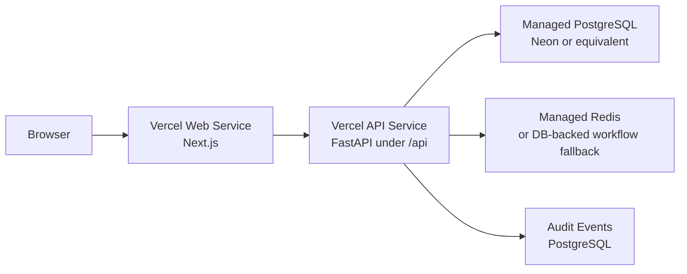

# DEPLOY-002: Production Backend, Managed Persistence, and Frontend API Integration

## Purpose

`DEPLOY-002` upgrades the public proposal demo from a frontend-only Vercel deployment into a cloud-backed SaaS demo.

The target is to run the FastAPI service, managed PostgreSQL, and either managed Redis or a database-backed workflow fallback in production, then point the Next.js frontend at that production API.

## Current State

The production frontend is live:

- Web: `https://ai-growth-ops-platform.vercel.app`
- Vercel project: `vincent-lius-projects-de5eeb92/ai-growth-ops-platform`
- Current Vercel root directory: `apps/web`
- Current framework preset: Next.js

The backend and persistence layer still run locally through Docker Compose:

- FastAPI: `apps/api`
- PostgreSQL: local Compose service
- Redis: local Compose service
- Celery: local Compose worker

## Deployment Architecture



## Implemented Readiness Changes

- Added root `vercel.json` with Vercel Services configuration:
  - `web` service: `apps/web` at `/`
  - `api` service: `apps/api/app/main.py` at `/api`
- Added API production dependency lock surface through `apps/api/requirements.txt`.
- Added frontend API URL helpers that support:
  - `API_URL`
  - `API_INTERNAL_BASE_URL`
  - `NEXT_PUBLIC_API_URL`
  - `NEXT_PUBLIC_API_BASE_URL`
- Added backend support for Vercel/Neon-style Postgres variables:
  - `DATABASE_URL`
  - `POSTGRES_URL`
  - `POSTGRES_URL_NON_POOLING`
- Added PostgreSQL URL normalization for SQLAlchemy + psycopg 3.
- Added comma-separated `CORS_ORIGINS` parsing.
- Added `WORKFLOW_QUEUE_MODE=database` fallback so production demos can operate without Redis while managed Redis is pending.
- Updated `/health` and `/health/deep` to expose queue mode and avoid hard 500s when production persistence is not configured.

## Required Vercel Project Changes

To activate the multi-service deployment, the current Vercel project must move from a frontend-only configuration to Services:

- Root Directory: repository root, not `apps/web`
- Framework Preset: Services
- Build source: GitHub `main`

Expected service routes after activation:

- Web: `/`
- API: `/api`
- Health: `/api/health`
- Deep health: `/api/health/deep`
- Workspace API: `/api/workspace/...`

## Required Managed Resources

### PostgreSQL

Preferred path:

- Vercel Marketplace Neon Postgres

Required env for the API:

- `DATABASE_URL`, or
- `POSTGRES_URL`, or
- `POSTGRES_URL_NON_POOLING`

After provisioning, run:

```powershell
cd apps/api
alembic upgrade head
alembic current
```

Production validation:

```text
GET https://ai-growth-ops-platform.vercel.app/api/health
GET https://ai-growth-ops-platform.vercel.app/api/health/deep
```

### Redis or Queue Fallback

Option A: Managed Redis

- Provision Upstash Redis or another Redis-compatible service.
- Set `REDIS_URL`.
- Keep `WORKFLOW_QUEUE_MODE=redis`.

Option B: DB-backed workflow fallback

- Set `WORKFLOW_QUEUE_MODE=database`.
- Leave `REDIS_URL` unset.
- Use the existing inline processing endpoint for deterministic demos:
  - `POST /api/workspace/background-jobs/process-pending`

This fallback is acceptable for the Technical Proposal Demo because MVP-006 and MVP-007 already persist workflow intent and job state in PostgreSQL.

## Production Environment Variables

Recommended production values after Services activation:

```text
APP_ENV=production
APP_NAME=AI Growth Ops Platform API
AUTH_PROVIDER=demo-header
NEXT_PUBLIC_AUTH_PROVIDER=demo-header
CORS_ORIGINS=https://ai-growth-ops-platform.vercel.app
API_INTERNAL_BASE_URL=https://ai-growth-ops-platform.vercel.app/api
NEXT_PUBLIC_API_BASE_URL=/api
WORKFLOW_QUEUE_MODE=database
NOTIFICATION_PROVIDER=mock
```

When Vercel Services is active, the generated service variables should take
precedence over legacy demo values:

```text
API_URL=<generated by Vercel Services>
NEXT_PUBLIC_API_URL=<generated by Vercel Services, usually /api>
```

Add managed persistence:

```text
DATABASE_URL=<managed-postgres-url>
# or POSTGRES_URL=<managed-postgres-url>

# Optional if using Redis:
REDIS_URL=<managed-redis-url>
WORKFLOW_QUEUE_MODE=redis
```

## Acceptance Criteria

- Vercel production deployment uses Services.
- `GET /api/health` returns `status: ok`.
- `GET /api/health/deep` returns database `ok`.
- Queue check returns either Redis `ok` or database queue fallback `ok`.
- Alembic migrations have run against managed PostgreSQL.
- `/workspace` reads production API through `/api`.
- Dashboard metrics are API-backed in production.
- Production error logs show no critical runtime failures.

## Not Included

- Real LLM provider.
- Real notification provider.
- External CRM integrations.
- External review platform integrations.
- Production Auth0 tenant secrets.
- Long-running Celery worker deployment.

## Operational Notes

Vercel Services can host the API request runtime. A persistent Celery worker should be deployed separately if the product requires continuously running background workers. For the proposal demo, database-persisted jobs plus inline processing are sufficient and avoid introducing another production runtime before provider integrations are selected.

## Recommended Next Step

Provision managed PostgreSQL, choose Redis vs DB-backed workflow fallback, then switch the Vercel project from `apps/web` root to repository root with the Services framework preset.
